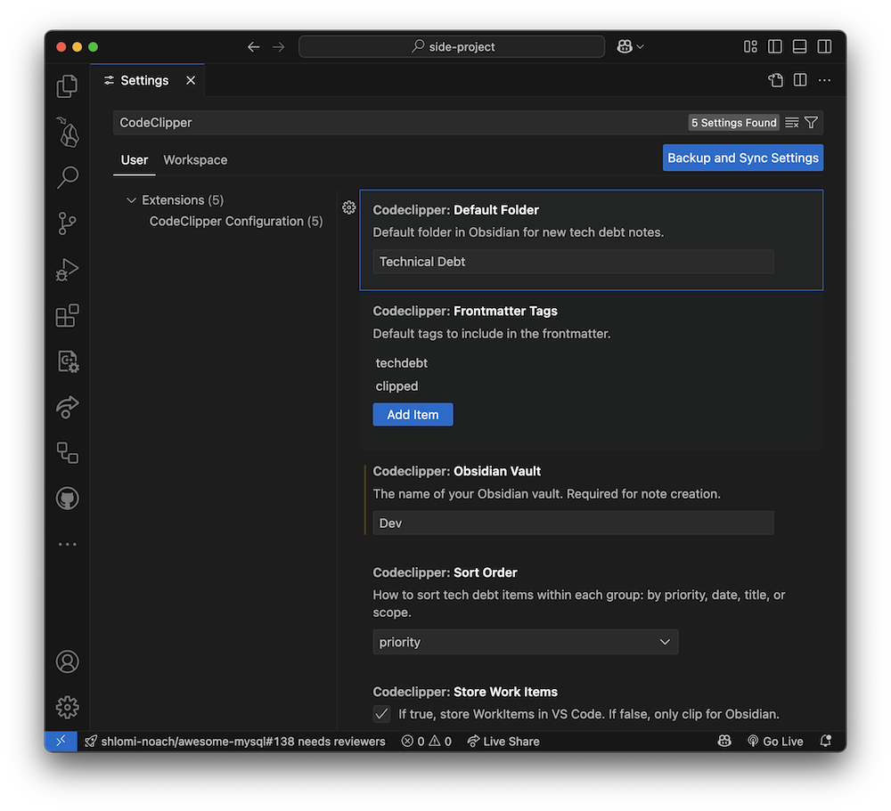

# CodeClipper: VS Code to Obsidian Tech Debt Logger

CodeClipper is a VS Code extension that lets you quickly capture code snippets, add context and metadata (such as technical debt), and send them as structured notes directly to your Obsidian vault.

## Features

- Select code in VS Code and trigger CodeClipper via command, shortcut, or context menu
- Add a description, title, priority, and scope for the clipped code
- Automatically captures file path, line numbers, Git branch, and code author
- Creates a new note in your chosen Obsidian vault with all details and the code block
- Configurable vault name, note folder, and tags

## How It Works

1. Select code in the editor
2. Trigger CodeClipper (Command Palette, shortcut, or context menu)
3. Fill in the description, title, priority, and scope
4. Click "Send to Obsidian"—a new note is created in your vault with all details

## Prerequisites

- [Obsidian](https://obsidian.md/) installed and a vault created
- [Git](https://git-scm.com/) installed (for branch and author info)

## Configuration

- Set your Obsidian vault name and default folder in the extension settings
- (Optional) Customize tags and other preferences

